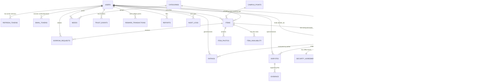

# Entity Relationship Diagram (docs/ER_DIAGRAM.md)

```mermaid
erDiagram
    USERS ||--o{ REFRESH_TOKENS : "has active sessions"
    USERS ||--o{ EMAIL_TOKENS : "receives verification/reset"
    USERS ||--o{ ITEMS : "owns/lists"
    USERS ||--o{ NEEDS : "posts"
    USERS ||--o{ BORROW_REQUESTS : "initiates"
    USERS ||--o{ TRANSACTIONS : "lends (lender_id)"
    USERS ||--o{ TRANSACTIONS : "borrows (borrower_id)"
    USERS ||--o{ TRUST_EVENTS : "accumulates"
    USERS ||--o{ REWARD_TRANSACTIONS : "earns ledger points"
    USERS ||--o{ RATINGS : "gives/receives"
    USERS ||--o{ DISPUTES : "opens/resolves"
    USERS ||--o{ REPORTS : "files"
    USERS ||--o{ AUDIT_LOGS : "acts upon"

    CAMPUS_POINTS ||--o{ ITEMS : "designated meeting spot"
    CATEGORIES ||--o{ ITEMS : "groups"
    CATEGORIES ||--o{ NEEDS : "groups"

    ITEMS ||--o{ ITEM_PHOTOS : "contains"
    ITEMS ||--o{ ITEM_AVAILABILITY : "has time slots"
    ITEMS ||--o{ BORROW_REQUESTS : "receives"
    ITEMS ||--o{ TRANSACTIONS : "item being borrowed"

    TRANSACTIONS ||--|| SECURITY_AGREEMENTS : "has offline terms"
    TRANSACTIONS ||--o{ TRANSACTION_EVENTS : "logs status transitions"
    TRANSACTIONS ||--o{ CONDITION_RECORDS : "before & after evidence"
    TRANSACTIONS ||--o{ HANDOVER_TOKENS : "generates single-use QR"
    TRANSACTIONS ||--o{ HANDOVER_RECORDS : "logs physical scan"
    TRANSACTIONS ||--o{ MESSAGES : "in-app discussion"
    TRANSACTIONS ||--o{ DISPUTES : "subject of issue"
    TRANSACTIONS ||--o{ RATINGS : "evaluated by parties"

    DISPUTES ||--o{ EVIDENCE : "supporting files"
```
