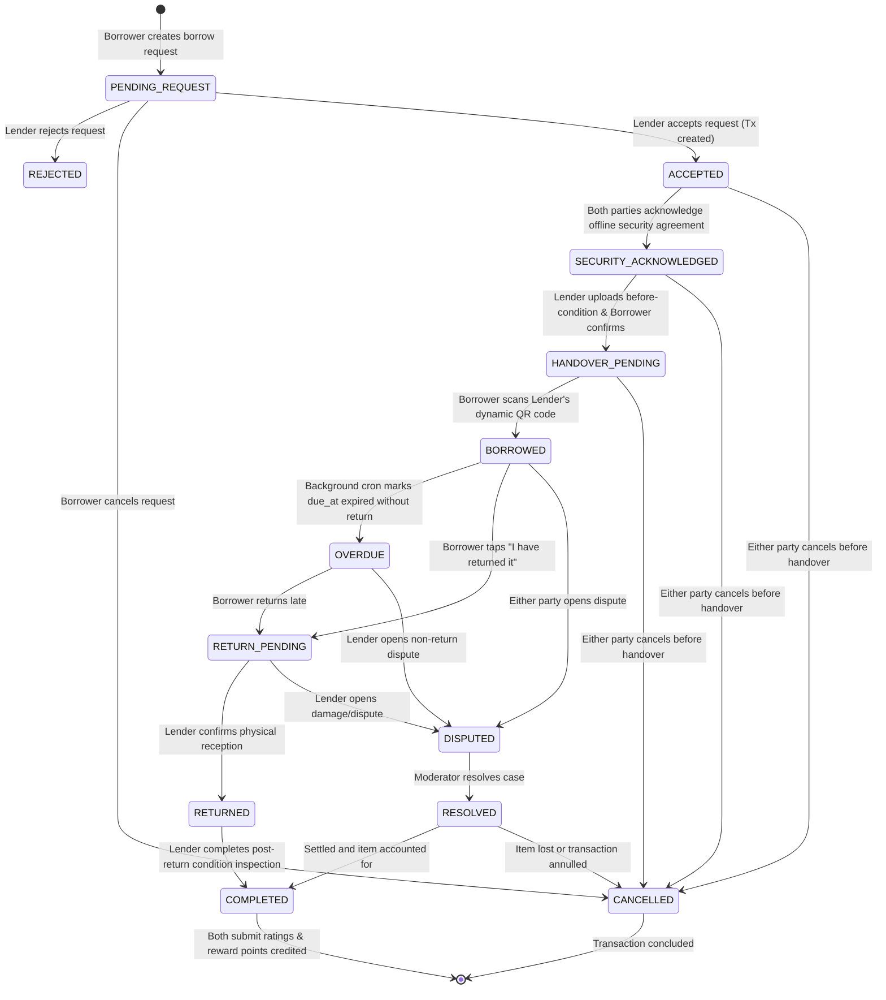

# Transaction State Machine (docs/STATE_MACHINE.md)

## State Machine Overview

The transaction state machine is the core engine of Borrow Before Buy (BBB). It coordinates the entire lifecycle from initial borrow request to completion or dispute resolution.

## State Definitions & Guard Conditions

| Current State | Next State | Triggering Action | Actor Allowed | Guard Conditions & Side Effects |
| :--- | :--- | :--- | :--- | :--- |
| `PENDING_REQUEST` | `ACCEPTED` | `ACCEPT_REQUEST` | Lender (Item Owner) | No active overlapping transaction for item; Creates Transaction row in DB. |
| `PENDING_REQUEST` | `REJECTED` | `REJECT_REQUEST` | Lender | Request marked rejected; reason optional. |
| `PENDING_REQUEST` | `CANCELLED` | `CANCEL_REQUEST` | Borrower | Request marked cancelled. |
| `ACCEPTED` | `SECURITY_ACKNOWLEDGED` | `ACKNOWLEDGE_SECURITY` | Both (Borrower & Lender) | Requires both `borrower_acknowledged` and `lender_acknowledged` to be true. |
| `ACCEPTED` / `SECURITY_ACKNOWLEDGED` | `CANCELLED` | `CANCEL_TRANSACTION` | Either | Allowed before handover; penalizes Lender if Lender cancels after accepting. |
| `SECURITY_ACKNOWLEDGED` | `HANDOVER_PENDING` | `ACKNOWLEDGE_CONDITION` | Borrower | Lender must have uploaded `BEFORE` condition photos/checklist, and Borrower must acknowledge. |
| `HANDOVER_PENDING` | `BORROWED` | `CONFIRM_HANDOVER` | Borrower (Scans QR) | Validates signed QR JWT / manual code, verifies single-use token atomically; sets item as borrowed. |
| `BORROWED` | `OVERDUE` | `FLAG_OVERDUE` | System Cron Job | Triggered when `NOW() > due_at` and status is `BORROWED`. Sends urgent notification. |
| `BORROWED` / `OVERDUE` | `RETURN_PENDING` | `INITIATE_RETURN` | Borrower | Borrower signals physical handover to lender. |
| `RETURN_PENDING` | `RETURNED` | `CONFIRM_RETURN` | Lender | Lender acknowledges physical item handover. |
| `RETURNED` | `COMPLETED` | `COMPLETE_INSPECTION` | Lender | Lender verifies item condition (optional after-photos); triggers trust updates & reward points. |
| `BORROWED` / `OVERDUE` / `RETURN_PENDING` | `DISPUTED` | `OPEN_DISPUTE` | Either | Freezes transaction, requires dispute type & description, notifies moderators. |
| `DISPUTED` | `RESOLVED` | `RESOLVE_DISPUTE` | Moderator / Admin | Requires written resolution notes; applies trust penalties and audit log. |
